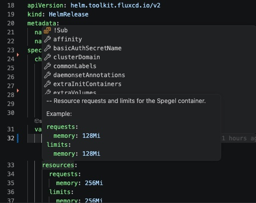

# Flux Helm IntelliSense

Flux Helm IntelliSense is a VS Code extension that provides Helm values IntelliSense inside Flux `HelmRelease.spec.values` blocks.



It resolves the `HelmRepository` referenced by each `HelmRelease`, pulls the chart locally with `helm`, and reads either `values.schema.json` or `values.yaml` to provide:

- key completions inside `spec.values`
- hover descriptions and examples
- unknown-key diagnostics from strict schemas or best-effort `values.yaml` defaults
- per-block CodeLens actions for resolved chart details, schema, values, and Helm pull commands
- a status bar indicator for the active HelmRelease

## Requirements

- VS Code `^1.90.0`
- local `helm` installed and available on `PATH`, or configured through `fluxHelmValues.helmPath`
- a workspace containing Flux `HelmRelease` resources and matching `HelmRepository` resources

## How It Works

For each YAML document, the extension:

1. detects Flux `HelmRelease` resources
2. scopes IntelliSense to the matching `spec.values` block
3. resolves `spec.chart.spec.sourceRef` to a `HelmRepository`
4. pulls the chart with `helm pull`
5. reads `values.schema.json` when available, otherwise `values.yaml`
6. caches resolved chart metadata under the VS Code global storage directory

Repository lookup supports:

- same-file `HelmRepository` resources
- sibling YAML files in the same directory
- full workspace lookup when needed
- configured extra repository search paths for local repos outside the current workspace
- namespace-less `HelmRepository` manifests that rely on external namespace injection

## Commands

- `Flux Helm IntelliSense: Refresh Chart Cache`
- `Flux Helm IntelliSense: Clear Chart Cache`
- `Flux Helm IntelliSense: Show Resolved Chart`
- `Flux Helm IntelliSense: Copy Helm Pull Command`
- `Flux Helm IntelliSense: Show Logs`

## Settings

- `fluxHelmValues.helmPath`: path to the Helm executable, default `helm`
- `fluxHelmValues.cacheTtlHours`: successful chart cache TTL, default `24`
- `fluxHelmValues.linting.enabled`: enable schema and `values.yaml`-backed lint warnings, default `true`
- `fluxHelmValues.repositorySearchPaths`: extra files, folders, or glob patterns to scan for `HelmRepository` manifests after same-file, sibling, and workspace lookup fails

Example:

```json
{
  "fluxHelmValues.linting.enabled": true,
  "fluxHelmValues.repositorySearchPaths": [
    "/Users/me/projects/**/*.yaml",
    "C:\\Users\\me\\projects\\**\\*.yaml",
    "../shared-flux-sources"
  ]
}
```

## Private OCI Registries

Flux Helm IntelliSense uses your configured `helm` executable and does not store registry credentials. For private OCI registries, authenticate Helm first:

```bash
helm registry login <registry-host>
```

For Azure Container Registry, you can also use:

```bash
az acr login --name <registry-name>
```

If `helm pull` fails, the extension output includes the Helm exit code, signal when available, stderr, stdout, and an OCI registry login hint for authorization failures.

Use `Flux Helm IntelliSense: Copy Helm Pull Command` or the `Copy helm pull` CodeLens above a `values:` block to copy the exact `helm pull` command the extension uses. Running that command in a terminal is the fastest way to debug registry authentication and verify that `helm registry login` or `az acr login` fixed access.

## Development

Install dependencies:

```bash
npm install
```

Compile:

```bash
npm run compile
```

Run tests:

```bash
npm test
```

Launch the extension in an Extension Development Host:

1. open this repository in VS Code
2. run the `Run Extension` debug configuration with `F5`
3. open a Flux repository in the Extension Development Host

## Manual Testing

This repository includes `MANUAL_SMOKE_TEST.md` with a step-by-step smoke-test flow against a Flux repo.

## Publishing

This repository includes `PUBLISHING.md` with Marketplace publishing steps and a pre-publish checklist.
